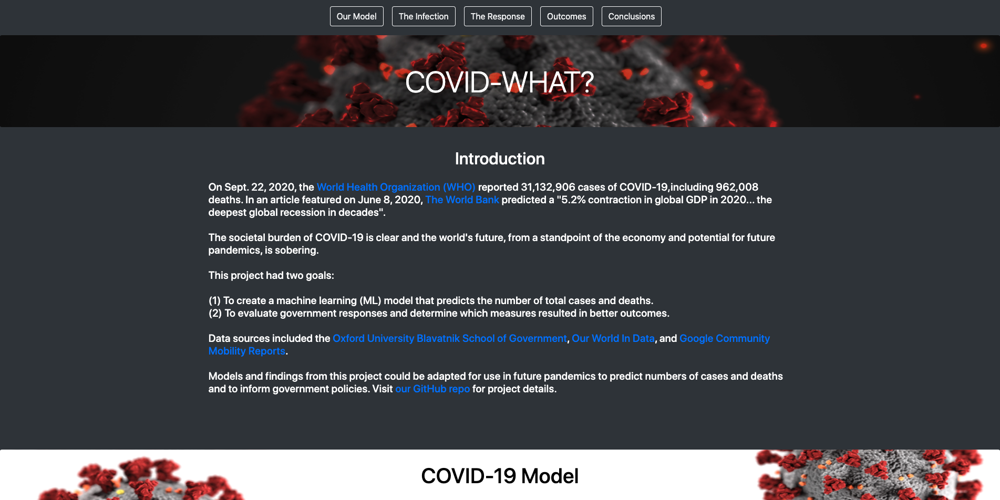
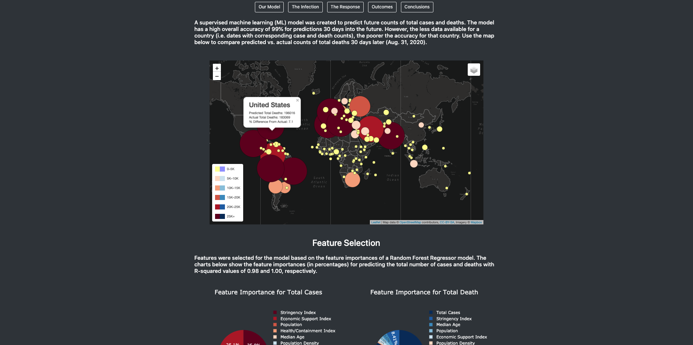

# COVID-19 Dashboard

This repo contains dashboard content for a coronavirus disease of 2019 (COVID-19) project. Explore our dashboard at [https://pmmfs.github.io/](https://pmmfs.github.io/). 

The project's goals were to (1) build a machine learning model to predict the number of total cases and deaths due to COVID-19, (2A) evaluate whether governments were successful in containing the spread of COVID-19, and (2B) determine which government measures lead to better outcomes. 

For project details, including data sources, visit the ["capstone-project" repo](https://github.com/pmmfs/capstone-project.git).

Sample screenshots of the dashboard are shown below (Figures 1 and 2).

#### Figure 1

#### Figure 2

